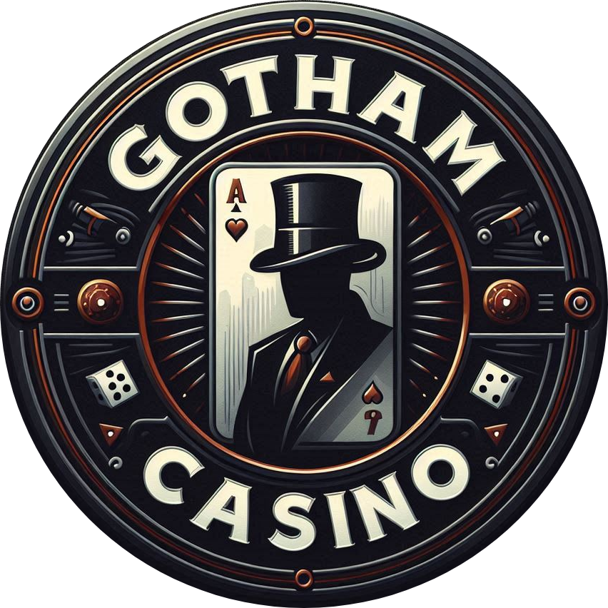
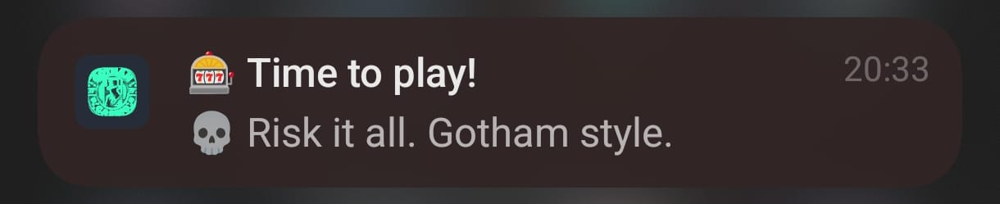
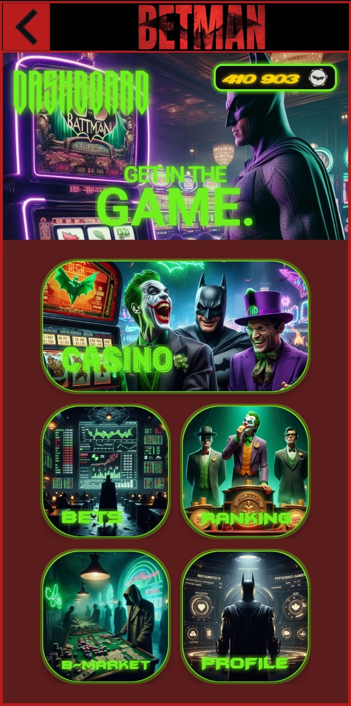
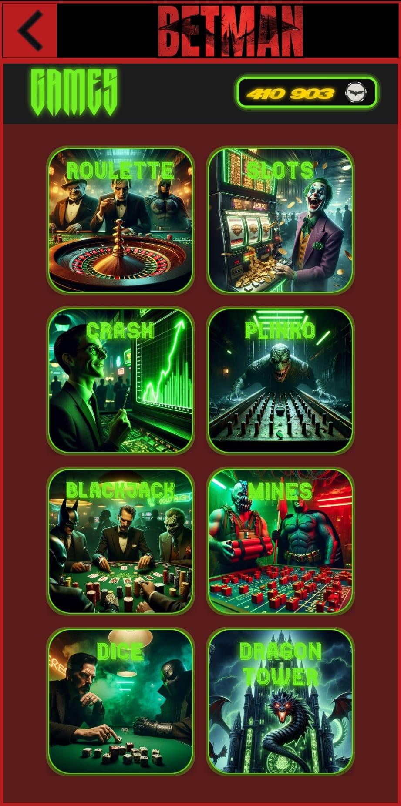
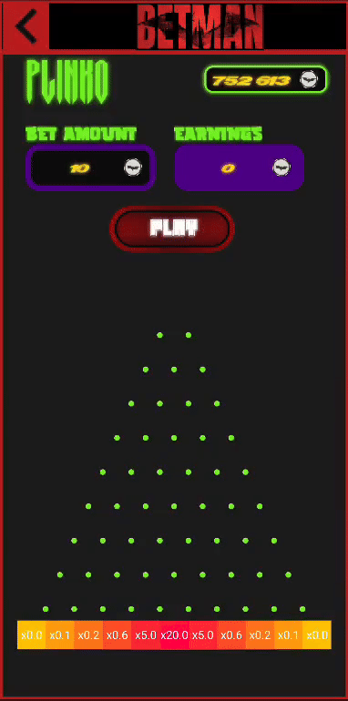
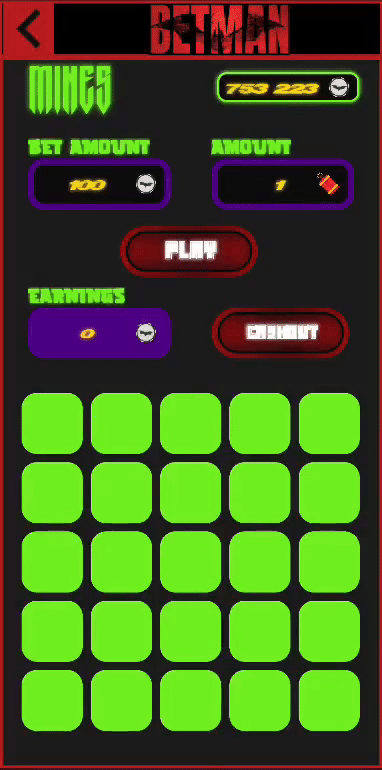
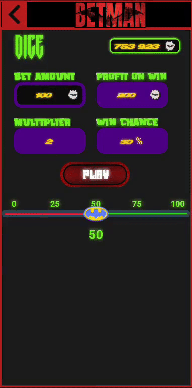
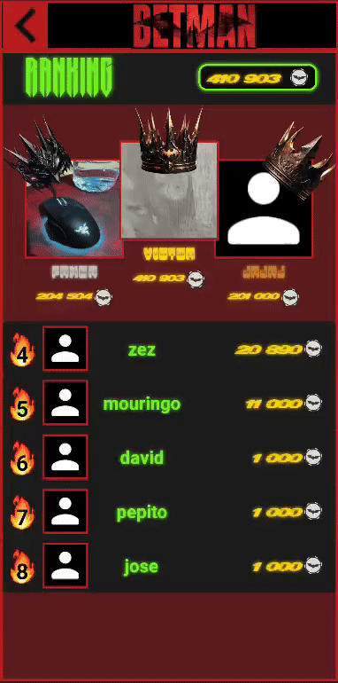
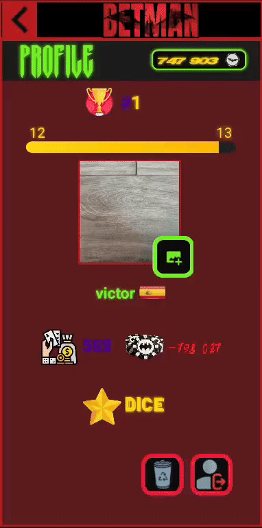

<a id="readme-top"></a>

<!-- PROJECT SHIELDS -->
[![Contributors][contributors-shield]][contributors-url]
[![Forks][forks-shield]][forks-url]
[![Stargazers][stars-shield]][stars-url]
[![Issues][issues-shield]][issues-url]
[![MIT License][license-shield]][license-url]
[![LinkedIn][linkedin-shield]][linkedin-url]

<!-- PROJECT LOGO -->
<br />
<div align="center">
  <a href="https://github.com/victorkvor/casino-mobile-app-betman">
    
  </a>
  <h3 align="center">Betman: Casino Mobile App</h3>

  <p align="center">
    Betman is a mobile application developed in <b>Android Studio</b> using <b>Kotlin</b>, featuring a fictional and satirical theme inspired by Gotham's criminal underworld.
    <br />
    <a href="https://github.com/victorkvor/casino-mobile-app-betman"><strong>Explore the docs »</strong></a>
    <br />
    <br />
    <a href="https://github.com/victorkvor/casino-mobile-app-betman">View Demo</a>
    ·
    <a href="https://github.com/victorkvor/casino-mobile-app-betman/issues/new?labels=bug&template=bug-report---.md">Report Bug</a>
    ·
    <a href="https://github.com/victorkvor/casino-mobile-app-betman/issues/new?labels=enhancement&template=feature-request---.md">Request Feature</a>
  </p>
</div>

<!-- TABLE OF CONTENTS -->
<details>
  <summary>Table of Contents</summary>
  <ol>
    <li>
      <a href="#about-the-project">🔎 About The Project</a>
      <ul>
        <li><a href="#built-with">🔨 Built With</a></li>
        <li><a href="#information">ℹ️ Additional Information</a></li>
        <li><a href="#attribution">🏷️ Attribution</a></li>
      </ul>
    </li>
    <li>
      <a href="#getting-started">🚀 Getting Started</a>
      <ul>
        <li><a href="#prerequisites">📝 Prerequisites</a></li>
        <li><a href="#installation">📥 Installation</a></li>
      </ul>
    </li>
    <li>
      <a href="#screens">🧱 App Screens</a>
      <ul>
        <li><a href="#notifications">🔔 Notifications</a></li>
        <li><a href="#login">🔐 Login</a></li>
        <li>
          <a href="#dashboard">🏠 Dashboard</a>
          <ul>
            <li><a href="#game-modes">🕹️ Casino: Game Modes</a></li>
            <li><a href="#bets">🎰 Bets</a></li>
            <li><a href="#ranking">🏆 Ranking</a></li>
            <li><a href="#black-market">🏴‍☠️ Black Market</a></li>
            <li><a href="#profile">🪪 Profile</a></li>
          </ul>
        </li>
      </ul>
    </li>
    <li><a href="#resources">📚 Resources</a></li>
    <li><a href="#contributing">🤝 Contributing</a></li>
    <li><a href="#license">©️ License</a></li>
    <li><a href="#contact">☎️ Contact</a></li>
  </ol>
</details>

<!-- ABOUT THE PROJECT -->
## 🔎 About The Project <a id="about-the-project"></a>
  <p align="justify">
    Betman is a satirical mobile gambling app inspired by Gotham’s criminal underworld, offering an immersive experience where they can engage in multiple illegal gambling activities. The design and mechanics of the casino games draw inspiration from the popular crypto casino, Stake.
  </p>
<p align="right">(<a href="#readme-top">back to top</a>)</p>

### 🔨 Built With <a id="built-with"></a>
* [![Kotlin][kotlin-shield]][kotlin-url]
* [![Android Studio][android-studio-shield]][android-studio-url]

<p align="right">(<a href="#readme-top">back to top</a>)</p>

### ℹ️ Additional Information <a id="information"></a>
The application was developed over a period of two to three weeks with minimal prior experience in Android Studio and little time available, so it has significant room for improvement. It was created as part of a university course. Also, Artificial Intelligence (AI) was used to generate most of the image resources in the project.

> [!IMPORTANT]
> Please note that the application contains bugs, especially in the Minesweeper game: if you select multiple tiles quickly and reveal a bomb, the game may allow you to continue playing for a short time.

<p align="right">(<a href="#readme-top">back to top</a>)</p>

### 🏷️ Attribution <a id="attribution"></a>
- **[theory11](https://store.theory11.com/products/batman-dark-knight-playing-cards)**: The design of the cards used for the Blackjack game was inspired by theory11's Batman Dark Knight deck.
- **[Stake](https://stake.com)**:  Most of the games were inspired by the crypto casino Stake. Assets from the Dragon Tower game are also reused from it.
- **[Icons8](https://icons8.com)**: Several UI icons were obtained from Icons8.
- **[Flaticon](https://www.flaticon.com)**: Various asset icons were obtained from Flaticon.
- **[LottieFiles](https://lottiefiles.com)**: The fire animation used in the ranking screen was obtained from LottieFiles.
- **[Mockaroo](https://www.mockaroo.com)**: Mockaroo was the API used to generate random data of a predefined structure for the Bets screen in the other casinos section.
- **[Dafont](https://www.dafont.com)**: Custom fonts for the app were downloaded from Dafont.
- **[Pixabay](https://pixabay.com/sound-effects)**: Most sound effects were obtained from Pixabay.
- **[FlagsAPI](https://flagsapi.com)**: Used to display the user’s regional flag in the profile.
- **[Microsoft Bing](https://www.bing.com/images/create)**: Most of the illustrations and images were generated using AI through Bing's image generation tool.

Additionally, sound effects from well-known games such as L.A. Noire, Clash Royale, and Mario Kart/Mario Party were used to enhance the user experience.

<p align="right">(<a href="#readme-top">back to top</a>)</p>

<!-- GETTING STARTED -->
## 🚀 Getting Started <a id="getting-started"></a>

To get started with **Betman**, follow these steps depending on whether you want to build from source or simply run the APK.

### 📝 Prerequisites <a id="prerequisites"></a>

If you want to modify or build upon this project, you will need Android Studio, which requires the following computer specifications:

| Component      | Minimum                                     | Recommended                                                       |
|----------------|---------------------------------------------|--------------------------------------------------------------------|
| **OS**         | Windows 10 (64-bit)                         | Latest 64-bit Windows version                                      |
| **RAM**        | 8 GB (Studio) / 16 GB (with Emulator)       | 32 GB                                                              |
| **CPU**        | Virtualization support (VT-x / AMD-V)       | Latest Intel i5/i7/i9 or AMD Ryzen 5/7/9 (no N/U-series CPUs)      |
|                | Intel 8th Gen or AMD Zen (2017+)            |                                                                    |
| **Disk Space** | 16 GB (Studio + Emulator)                   | SSD with at least 32 GB free                                       |
| **Resolution** | 1280 × 800                                  | 1920 × 1080                                                        |
| **GPU**        | 4 GB VRAM (e.g., GeForce 10 / RX 5000+)     | 8 GB VRAM (e.g., GeForce 20+ / RX 6600+) with updated drivers      |

> [!WARNING]
> Intel Core **N-Series** and **U-Series** processors are **not recommended** due to insufficient performance.

> Extracted from [Android Studio official installation guide](https://developer.android.com/studio/install)

<p align="right">(<a href="#readme-top">back to top</a>)</p>

### 📥 Installation <a id="installation"></a>

#### 🔧 Option 1: Clone & Build with Android Studio

1. **Clone the repository**  
   Open a terminal and run:
   ```bash
   git clone https://github.com/victorkvor/casino-mobile-app-betman.git
   ```

2. **Open the project in Android Studio**

   * Launch Android Studio.
   * Click on `File > Open` and select the cloned folder.

3. **Wait for Gradle to build**

   * Let Android Studio sync and resolve all dependencies.

4. **Run the app**

   * Connect an Android device or use the emulator.
   * Click the green "Run" ▶️ button or press **Shift+F10**.

#### 📱 Option 2: Download and Install the APK

If you don't want to build the app, you can [**download the APK directly**](https://github.com/victorkvor/casino-mobile-app-betman/releases) from the [Releases](https://github.com/victorkvor/casino-mobile-app-betman/releases) page.

> [!WARNING]
> To install the APK on your device, make sure to **enable installation from unknown sources** in your Android settings.

<p align="right">(<a href="#readme-top">back to top</a>)</p>

## 🧱 App Screens <a id="screens"></a>

This section describes the main screens and features of **Betman**, along with their visual and functional elements.

---

### 🔔 Notifications <a id="notifications"></a>

The app is designed to generate a **random notification every hour** from the following list of possible notification messages:

- 🎰 Your luck awaits at Gotham Casino!
- 🃏 Time to test your fate, joker!
- 💸 Feeling lucky? Big wins are waiting!
- 🎲 Step into the shadows and play!
- 🤑 Come back and hit the jackpot!
- 👑 Rule the table, King of Gotham!
- 🎰 Spin the reels of destiny!
- 🔥 The casino calls... Will you answer?
- 💀 Risk it all. Gotham style.
- 🦇 Even Batman can’t stop your winning streak!
- ⚔️ Dare to defy the odds?
- 🚬 Light up the night with your bets!
- 🔮 What will the cards reveal today?
- 🎯 Aim for the top, legend!
- 🎉 Your empire of luck begins now!

<div align="center"></div>

<p align="right">(<a href="#readme-top">back to top</a>)</p>

---

### 🔐 Login <a id="login"></a>

The login screen is preceded by an animated splash screen inspired by the **Marvel Comics intro**.
The login logic is based on the following flow:
- If a new username is introduced, the app **registers it** in the database along with the entered password.
- If the username already exists:
  - If the password doesn't match, login **fails**.
  - If the password matches, the login **succeeds** with that user from the database.

<div align="center"></div>

> [!NOTE]
> This functionality is implemented using the local **Room** database.

<p align="right">(<a href="#readme-top">back to top</a>)</p>

---

#### 🏠 Dashboard <a id="dashboard"></a>

This is the main panel after logging in, where you can navigate to other app screens:
- 🎰 **Casino** game modes.
- 📊 The casino **betting history** of all the users, and a fictional one from other casinos.
- 🏆 Global **ranking** of the top 8 players.
- 🏴‍☠️ A fictional **black market** for purchasing chips.
- 🪪 Your personal **profile**.

<div align="center"></div>

<p align="right">(<a href="#readme-top">back to top</a>)</p>

---

##### 🕹️ Casino: Game Modes <a id="game-modes"></a>

<div align="center"></div>

The following gambling games are available within the in-app **casino**, each with its own logic and user interface:

- 🎡 **Roulette**  
  A traditional European-style roulette wheel where users can place classic inside and outside bets.
  <div align="center"></div>

- 🎰 **Slots**  
  A three-strip slot machine featuring **three tiers of prizes**:  
  - 🥇 Gold Tier (highest value), there is only one symbol.
  - 🥈 Silver Tier (average value), there are two symbols.
  - 🥉 Bronze Tier (lowest value), there are three symbols.
  <div align="center"></div>

- 📉 **Crash**  
  A real-time multiplier game inspired by Stake’s *Crash*, where in this version users must **guess a multiplier that the graph surpasses before it crashes**.
  <div align="center"></div>

- 🟡 **Plinko**  
  Based on Stake’s *Plinko*, this game includes **11 possible drop slots**, with varying multipliers depending on the landing position, being the most rewarding the centric ones.
  <div align="center"></div>

- 🃏 **Blackjack**  
  The classic card game where users play **against the dealer**, trying to reach 21 without busting.
  <div align="center"></div>

- 💣 **Mines**  
  A minesweeper-inspired game (also from Stake), where users uncover tiles avoiding hidden bombs to **progressively increase their payout**. There are multiple difficulties based on the amount of mines selected.
  <div align="center"></div>

- 🎲 **Dice**  
  Stake-inspired dice betting game, where the player predicts whether the rolled value will be **above or below** a selected threshold.
  <div align="center"></div>

- 🐉 **Dragon Tower**  
  A level-based betting game inspired by Stake, where the player selects tiles to ascend a tower, where **the higher you go, the greater the risk and reward**. The game includes multiple difficulty levels that increase the challenge.
  <div align="center"></div>

<p align="right">(<a href="#readme-top">back to top</a>)</p>

---

##### 🎰 Bets <a id="bets"></a>

A full history of:
- All games played by users within the casino.
- A simulated feed of bets from **other underground casinos** using [Mockaroo](https://mockaroo.com/) API with random data:
  - **Dog fights**
  - **Russian roulette**
  - **Underground brawls**
  - **Illegal racing**

<div align="center"></div>

<p align="right">(<a href="#readme-top">back to top</a>)</p>

---

##### 🏆 Ranking <a id="ranking"></a>

Displays the **top 8 users** who have won the most amount of chips in the casino.

<div align="center"></div>

<p align="right">(<a href="#readme-top">back to top</a>)</p>

---

##### 🏴‍☠️ Black Market <a id="black-market"></a>

A fictional black market where players can "buy" chips to continue betting.

<div align="center"></div>

>[!NOTE]  
> No actual payment logic is implemented.

<p align="right">(<a href="#readme-top">back to top</a>)</p>

---

##### 🪪 Profile <a id="profile"></a>

The user's personal stats and information, including:
- Current **ranking** in the casino.
- **Experience level** based on games played.
- Profile image with live **photo change** support.
- Username and a **flag** of the region based on device locale.
- Total number of games played.
- **Balance**: total earnings vs losses.
- Most played **game mode**.
- Two bottom-right buttons:
  - 🗑️ **Delete account**.
  - 🔚 **Log out**.
 
<div align="center"></div>

<p align="right">(<a href="#readme-top">back to top</a>)</p>

---

<!-- RESOURCES -->
## 📚 Resources <a id="resources"></a>

Here are some additional resources that you may find useful:

- **[Android Developers](https://developer.android.com)**: Official documentation and tools from Google.
- **[Android Asset Studio](https://romannurik.github.io/AndroidAssetStudio)**: Generate launcher icons, action bar icons, and more.

<p align="right">(<a href="#readme-top">back to top</a>)</p>

<!-- CONTRIBUTING -->
## 🤝 Contributing <a id="contributing"></a>
Contributions are what make the open-source community such an amazing place to learn, inspire, and create. Any contributions you make are **greatly appreciated**.

1. Fork the Project
2. Create your Feature Branch (`git checkout -b feature/AmazingFeature`)
3. Commit your Changes (`git commit -m 'Add some AmazingFeature'`)
4. Push to the Branch (`git push origin feature/AmazingFeature`)
5. Open a Pull Request

<p align="right">(<a href="#readme-top">back to top</a>)</p>

<!-- LICENSE -->
## ©️ License <a id="license"></a>
Distributed under the MIT License. See `LICENSE` for more information.

<p align="right">(<a href="#readme-top">back to top</a>)</p>

<!-- CONTACT -->
## ☎️ Contact <a id="contact"></a>
Victor Kravchuk Vorkevych - victorkravchuk19@gmail.com

Project Link: [https://github.com/victorkvor/casino-mobile-app-betman](https://github.com/victorkvor/casino-mobile-app-betman)

<p align="right">(<a href="#readme-top">back to top</a>)</p>

<!-- MARKDOWN LINKS & IMAGES -->
<!-- https://www.markdownguide.org/basic-syntax/#reference-style-links -->
[contributors-shield]: https://img.shields.io/github/contributors/victorkvor/casino-mobile-app-betman.svg?style=for-the-badge
[contributors-url]: https://github.com/victorkvor/casino-mobile-app-betman/graphs/contributors
[forks-shield]: https://img.shields.io/github/forks/victorkvor/casino-mobile-app-betman.svg?style=for-the-badge
[forks-url]: https://github.com/victorkvor/casino-mobile-app-betman/network/members
[stars-shield]: https://img.shields.io/github/stars/victorkvor/casino-mobile-app-betman.svg?style=for-the-badge
[stars-url]: https://github.com/victorkvor/casino-mobile-app-betman/stargazers
[issues-shield]: https://img.shields.io/github/issues/victorkvor/casino-mobile-app-betman.svg?style=for-the-badge
[issues-url]: https://github.com/victorkvor/casino-mobile-app-betman/issues
[license-shield]: https://img.shields.io/github/license/victorkvor/casino-mobile-app-betman.svg?style=for-the-badge
[license-url]: https://github.com/victorkvor/casino-mobile-app-betman/blob/master/LICENSE.txt
[linkedin-shield]: https://img.shields.io/badge/-LinkedIn-black.svg?style=for-the-badge&logo=linkedin&colorB=555
[linkedin-url]: https://linkedin.com/in/victorkvor
[kotlin-shield]: https://img.shields.io/badge/-Kotlin-7F52FF?style=for-the-badge&logo=kotlin&logoColor=white
[kotlin-url]: https://kotlinlang.org
[android-studio-shield]: https://img.shields.io/badge/android%20studio-346ac1?style=for-the-badge&logo=android%20studio&logoColor=white
[android-studio-url]: https://developer.android.com/studio
